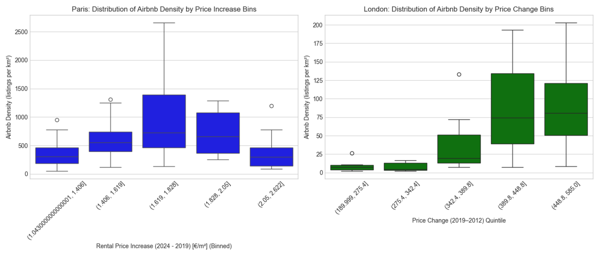

# Airbnb vs Long-Term Rental Price Analysis
&nbsp;
## Overview

This repository contains a study exploring the relationship between short-term rental density (Airbnb listings of 2024) and potential increases in long-term rental prices for two major European cities: Paris and London.
Paris : increase is in € per square meter
London : increase is in £

&nbsp;
## Environment Setup

Choose the instructions relevant to your operating system.

### Windows

To create a Python environment on Windows, you can use the [*Easy-Python-Environnement-Creator-for-Windows*](https://github.com/arnaudlvq/Easy-Python-Environnement-Creator-for-Windows).

Alternatively, you can follow the manual `venv` creation steps below.

### macOS / Linux / Windows (Manual `venv`)

1.  **Create a virtual environment using `venv`:**
    Open your terminal or command prompt.

    ```bash
    python -m venv venv
    ```
    *(Adjust `python3` or `python` based on your system's Python installation)*

2.  **Activate the virtual environment:**

    *   **macOS / Linux (bash/zsh):**
        ```bash
        source venv/bin/activate
        ```

    *   **Windows (Command Prompt - cmd.exe):**
        ```batch
        venv\Scripts\activate.bat
        ```
&nbsp;
## Install Dependencies

With the virtual environment activated, install all required packages from the `requirements.txt` file:

```bash
pip install -r requirements.txt
```
&nbsp;
## Launch the Analysis

1. Navigate to the `scripts` directory in your terminal:
    ```bash
    cd scripts
    ```

2. Start Jupyter Notebook:
    ```bash
    jupyter notebook
    ```

3. From the Jupyter Notebook interface that opens in your browser, open the `main.ipynb` file to view and run the analysis.
&nbsp;
## Repository Structure

.
├── requirements.txt        # List of Python packages needed
└── scripts/                # Folder containing analysis scripts and notebook
    └── main.ipynb          # The primary Jupyter notebook with code, commentary, and visualizations

* requirements.txt – List of Python packages needed for data gathering, analysis, and visualization.
* scripts/ – Folder containing data processing scripts and the Jupyter notebook.
    * main.ipynb – The primary notebook with code, commentary, and visualizations.
